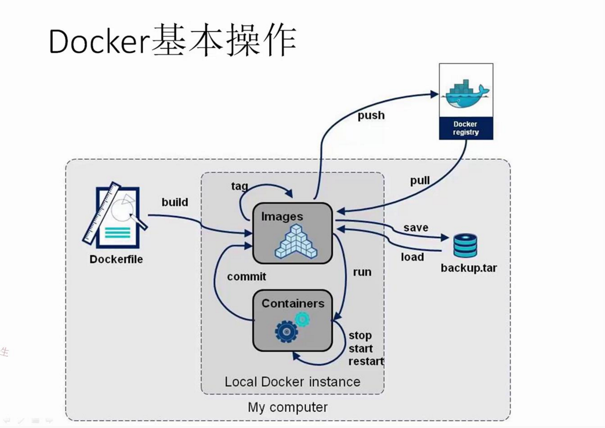

> docker官网上四只小动物分表代表docker, docker-swarm, linux, golang

## 大纲
- [Docker术语表](./术语表)
- [Centos7升级内核4.8.6并支持AUFS](./Centos7升级内核4.8.6并支持AUFS)
- [Docker底层实现](./Docker底层实现)
- Namespace Cgroups Lxc介绍
- [Install](./Docker软件包安装安装)
- [Get Started with Docker](./开始使用Docker)
- [Learn by example](./通过示例学习Docker)
- [User Guide](./用户指南)
- [Build private registry](./构建私有仓库)
- [registry api](./myscripts/req_docker_registry.py)
- [quick exec container](./myscripts/dgo)
- [Docker cli](./Docker cli.txt)  
- [Docker的思考](./Docker的思考)

## 参考文章  
[docker中文社区](https://github.com/arkii/docs)  
[docker中文文档](http://docker-doc.readthedocs.io/zh_CN/latest/)  
[docker官方英文文档](http://docs.master.dockerproject.org/)  
[基于flask的docker-registry-ui](https://github.com/arkii/docker-registry-ui)  
[Docker从入门到实战](https://yeasy.gitbooks.io/docker_practice/content/introduction/)  
